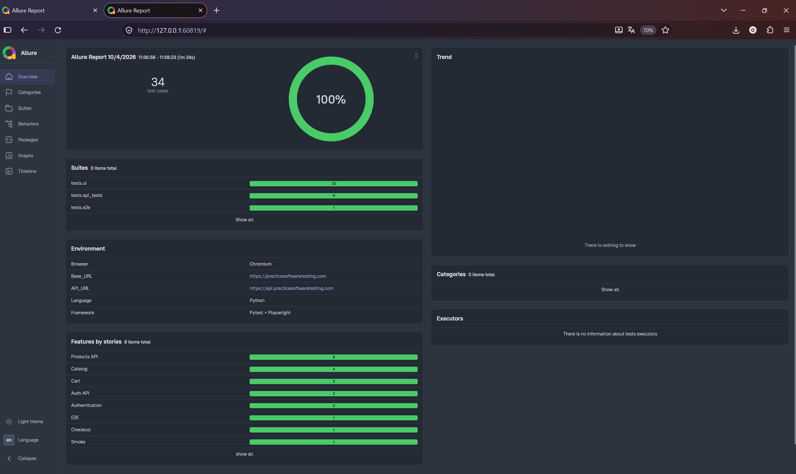

# Practice Software Testing: UI + API automation


Фреймворк автотестов для демо-магазина [Practice Software Testing](https://practicesoftwaretesting.com):
UI (Playwright), API (requests + pydantic) и сквозной сценарий с подготовкой данных через API.

**[Живой Allure-отчёт](https://amirka314.github.io/practice-software-testing-automation/)**



## Стек

| Задача | Инструмент |
|---|---|
| Язык, раннер | Python, pytest |
| UI | Playwright (sync API) |
| API | requests, pydantic |
| Отчёты | Allure |
| Повтор нестабильных | pytest-rerunfailures |
| Линтер | ruff |
| CI/CD | GitHub Actions, GitHub Pages |

## Что покрыто

| Блок | Тестов | Что проверяется |
|---|---|---|
| UI: логин | 4 | успешный вход, пустые поля, несуществующий пользователь |
| UI: каталог | 11 | поиск, сортировка, фильтр по категории, карточка товара |
| UI: корзина | 3 | добавление, удаление, итоговая сумма |
| UI: checkout | 2 | полный путь покупки, оплата наличными и картой |
| UI: прочее | 2 | smoke главной страницы, авторизация через API |
| API | 11 | схема ответов, пагинация, сортировка по всему каталогу, 404, логин |
| E2E | 1 | корзина создаётся через API, проверяется в UI |

Всего 34 теста.

## Подходы

- **Page Object Model:** локаторы и действия лежат в `pages/`, проверки только в тестах.
- **Фикстуры:** одноразовый пользователь регистрируется через API, браузер
  авторизуется токеном в `localStorage` вместо заполнения формы входа.
- **Параметризация:** способы оплаты, сортировки, поисковые запросы, негативные сценарии логина.
- **Ожидания без `sleep`:** `expect` и ожидание конкретных ответов бэкенда.
- **Контракт API:** pydantic-модели замечают удалённые или изменившиеся поля.
- **Allure:** шаги, severity, группировка по feature и story, скриншот при падении.

## Структура

```
.
├── .github/workflows/tests.yml
├── api/            клиенты API
├── config/         настройки
├── models/         pydantic-схемы
├── pages/          Page Object
├── tests/
│   ├── api_tests/
│   ├── e2e/
│   └── ui/
├── utils/          генератор тестового пользователя
└── docs/images/    скриншоты отчёта
```

## Запуск

```bash
python -m venv .venv
.venv\Scripts\activate          # macOS/Linux: source .venv/bin/activate
pip install -r requirements.txt
playwright install chromium
pytest                          # все тесты
pytest -m api                   # только API
pytest -m smoke                 # быстрые проверки
allure serve allure-results     # отчёт локально (нужны Java и Allure CLI)
```

Секретов не требуется: тестовый пользователь создаётся через API на каждый запуск.

## Ограничения и честные заметки

- Целевой сайт защищён Cloudflare, и на раннерах GitHub Actions показывается проверка
  на бота. Чтобы UI-тесты проходили в CI, **применён обход этой проверки**: запуск браузера
  под виртуальным экраном (Xvfb) с флагами, скрывающими признаки автоматизации, и
  подменой User-Agent. Он включается только при `CI=true`.
  Это сознательное решение для учебного демо-стенда, предназначенного для практики
  тестирования. Решение хрупкое: Cloudflare может изменить проверку, и UI-тесты в CI
  начнут падать без изменений в коде.
- API-тесты от этого не зависят.
- Тесты работают с общедоступным демо-сайтом, который иногда отвечает медленно, поэтому
  в CI включены повторы упавших тестов.

## Планы

- Запуск копии приложения в Docker в